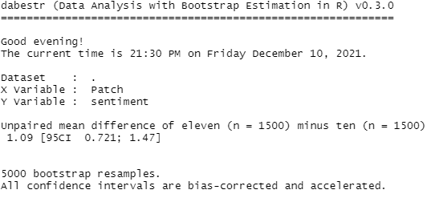
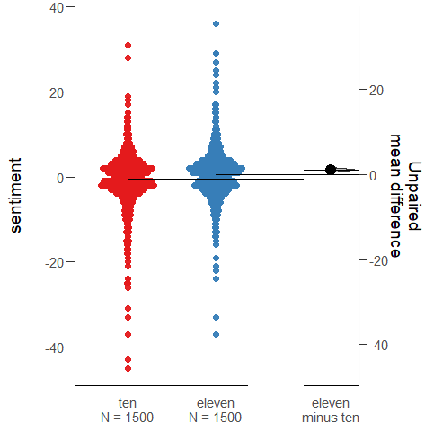

# Sentiment Analysis of Different Seasons of League of Legends
## Date: 12/10/2021

## Introduction

League of Legends is a game that once a year implements large scale fundamental changes to the game. Each cycle of these large-scale changes is called a season with small changes during each season called patches. Over the years parts of the community have said certain seasons were better than others. Especially how the changes in Season 11 made the game far less enjoyable compared to previous seasons. So, for this experiment I want to see how the community reacted to each season while it was still active and if people are looking back with rose-tinted glasses to previous seasons. 
My hypothesis is that the overall sentiment towards each season is going to be relatively similar and people look back at previous seasons with nostalgia.

## Rationale for Tool Selection/Methods

The biggest place for discussion about the game League of Legends is the subreddit r/LeagueOfLegends with over 5.5 million subscribers to the subreddit. The subreddit is even recognized as the central hub for discussion about the game and shut down their own dedicated forums. Because of all of these reasons using RedditExtractoR to scrape reddit comments from r/ LeagueOfLegends during the period of time of each season provides both a large volume of data but the best place to get the consensus about changes made about the game.

When assigning sentiment values to the comments, I wanted to make sure that a slightly negative comment wasn’t considered equal to an extremely negative comment. In case there was the same percentage of negative comments to positive comments within both seasons. I wanted to make sure that a slightly negatively comment made didn’t hold the same weight as a resoundingly negative comment. For this reason, I chose the afinn dictionary for sentiment to better classify which season was more positively or negatively received. An issue that can arise is that certain elements within game may accidentally trigger the dictionary 

To be able to compare the general sentiment between the two seasons mean difference estimation is perfectly suited for the task so the dabestr package was used as allows for easy mean difference estimation as well as the package having data presentation built in.

To graphically show the difference between the two means dabestr has a Gardner-Altman estimation plot has a that can show the underlying distribution of the two seasons. Alongside the upper and lower bounds for each distribution and how far spread each distribution is.

## Procedure

1. First, using the RedditExtractoR package, scrape all the threads on the r/LeagueOfLegends subreddit using the search terms “Patch 10. Notes” and “Patch 11. Notes” then filtering results so that the term “patch” is within the title. As well as removing any threads containing the word “bug” within the title because they’re focusing purely on what’s broken within the game and may have a higher negative sentiment than normal comments. Then consolidate all of the comments for their respective seasons into a data frame for each season for data processing.

2. Next, tokenize each comment and calculate the sentiment of a comment by using the afinn dictionary and assigning each comment a score by tokenizing the comment, obtaining the afinn score for each token, and summing the scores to get it’s assigned sentiment for the comment.

3. Next, take the two matrices and assign a label of Season 10 or Season 11 for mean difference testing. Then merge the two data frames to combine the two data frames for mean difference testing.

4. Now with the combined data frame, using the dabestr run a mean difference test between Season 11 and Season 10’s sentiment scores by randomly sampling comment sentiment scores from each season.

5. Visualize the data with dabestr for result presentation

## Results

 

*Figure 2: Mean difference results of Season 11 vs Season 10 from dabestr*

In Figure 2 above, the output of dabestr’s mean_diff function. The mean difference between Season 11 and Season 10 is 1.09 with a 95% confidence interval of [0.721, 1.47]

 

*Figure 1: Gardner-Altman estimation plot of Season 11 vs Season 10*

Figure 1 above shows the Gardner-Altman estimation plot generated by dabestr for the mean difference test between seasons. The blue dots represent sentiment scores of 1000 randomly sampled comments from Season 11 and likewise the red dots represent Season 10. The black lines coming from the red distribution is the mean for Season 10. While the line with a black dot on top of it indicates the value of the Season 11 distribution.

## Discussion

The results of the mean difference test showed that Season 11 had a higher sentiment than Season 10 by 1.09 with a 95% confidence interval of [0.721, 1.47] indicating that is extremely unlikely that the average sentiments are equal to each other so there is a meaningful difference between the two albeit the difference is not great. When looking at Figure 1 it shows that Season 11 has a higher upper bound while Season 10 has a greater lower bound. 

While I did hypothesize that the overall mean difference between the two would be similar. I found that Season 11 being higher than Season 10 to be surprising because the changes in Season 11 were far greater than the ones in Season 10 and as someone who was observing comments made during both comments the overall reception of the towards Season 11 to be much more negative when it was the current season. But as seen in the graph in Figure 1, the distribution for Season 10 has more points that are negative sentiment and the most negative comments come from season 10. 

Another surprising result from the Figure 1 graph was that both seasons had their mean sentiment scores around 0. I figured that most comments would either rather negative or positive when discussing the game.

So overall, while both have similar sentiments, Season 11 had a higher sentiment by 1.09 than Season 10.

## Citations

- Ivan Rivera (2021). RedditExtractoR: Reddit Data Extraction Toolkit. R package version 3.0.5. [Link](https://CRAN.R-project.org/package=RedditExtractoR)

- Hadley Wickham, Romain François, Lionel Henry and Kirill Müller (2021). dplyr: A Grammar of Data Manipulation. R package version 1.0.7. [Link](https://CRAN.R-project.org/package=dplyr)

- Silge J, Robinson D (2016). “tidytext: Text Mining and Analysis Using Tidy Data Principles in R.” _JOSS_, *1*(3). doi: 10.21105/joss.00037 (URL: [Link](https://doi.org/10.21105/joss.00037)

- Moving beyond P values: Everyday data analysis with estimation plots. (2019) Joses Ho, Tayfun Tumkaya, Sameer Aryal, Hyungwon Choi, Adam Claridge-Chang. Nature Methods 2019, 1548-710. doi: [Link](https://doi.org/10.1038/s41592-019-0470-3)
